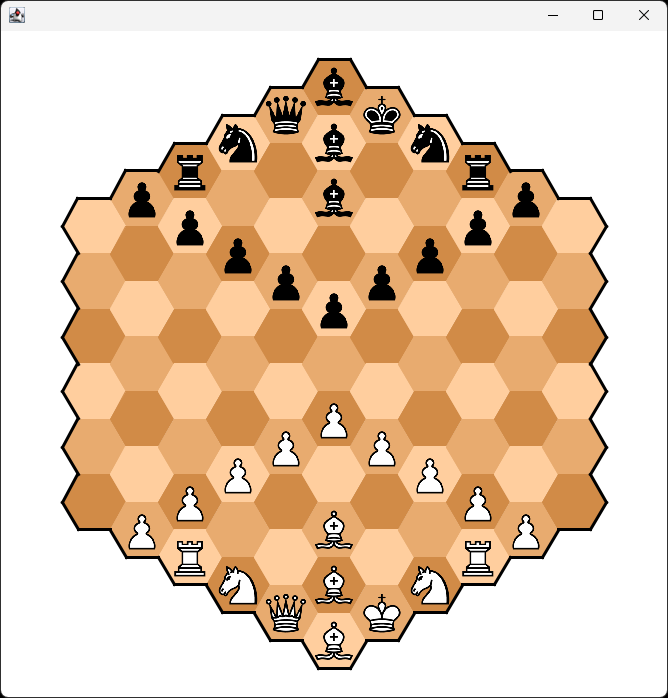

# HexaChess

## 🤝 Contribution

Contributions, suggestions, and new ideas are heartily welcomed. If you're considering significant modifications, please initiate an issue for discussion before submitting a pull request.

## 📜 License

This project is licensed under the MIT License. See the [LICENSE](LICENSE) file for details.

## 💖 Support

